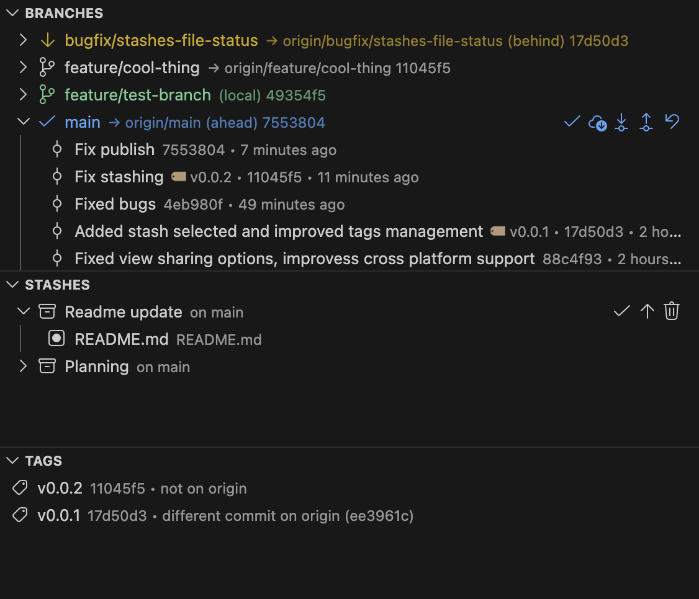

# GitFocal

[](https://github.com/giuliom/GitFocal/actions/workflows/test.yml)
[](https://github.com/giuliom/GitFocal/actions/workflows/codeql.yml)
[](https://github.com/giuliom/GitFocal/actions/workflows/package.yml)


A no-frills Visual Studio Code extension for Git. GitFocal adds four focused views to the Source Control sidebar: **Branches**, **Remotes**, **Stashes**, and **Tags**. It shells out to your local `git`, keeps runtime dependencies at zero, and is written in JavaScript.




## Features

### Branches view

- Lists local branches with current-branch indicator, ahead/behind counts, and upstream info
- Filter branches by name and sort by name or most recent commit
- Shows a warning entry when HEAD is detached
- Expanding a branch shows recent commits
- Inline actions: checkout, fetch, pull, push, publish branch, reset current branch
- Pull offers rebase/merge when branches have diverged; push offers force-with-lease when rejected
- Context menu: create from, rename, delete (with force), merge, rebase, squash, reset, change upstream, copy branch name/upstream/commit hash
- Commit actions: cherry-pick, revert, create tag at commit, copy commit hash
- Toggle to hide submodule repositories from the Branches view

### Worktrees

- A Worktrees group in the Branches view lists each worktree with its branch and main/current/locked/prunable state
- Add a worktree for an existing or new branch (from a branch's context menu or the view title), then open it in a new window or add it to the workspace
- Remove (with force fallback for dirty worktrees), lock/unlock, and prune worktrees, or copy a worktree's path
- Branches checked out in another worktree are marked with `⌂` and offer *Open Worktree in New Window* instead of checkout/delete
- Refreshes also react to checkouts and ref changes made in linked worktrees

### Remotes view

- Groups remote-tracking branches by remote and shows recent commits for each branch
- Filter remote branches by name from the view title
- Checkout a remote branch as a new local branch or create a local branch from it
- Fetch a specific remote, add remotes, and copy remote names or URLs
- Branch actions include merge, rebase, cherry-pick, reset, tag-at-commit, and copy commit hash
- Toggle to hide submodule repositories from the Remotes view

### Stashes view

- Lists stashes per repository and expands each stash to show changed files
- Open diffs, apply, pop, rename, and delete stashes
- Restore an individual file from a stash
- Stash changes from the view title or stash all / staged / unstaged / selected changes from SCM resource menus
- Toggle to hide submodule repositories from the Stashes view

### Tags view

- Lists tags per repository with commit/date details, annotated-tag indicator, and origin sync status
- Filter tags by name from the view title
- Create lightweight or annotated tags at `HEAD`, another ref, or directly from a branch commit
- Checkout, rename, delete, and delete remote tags
- Push tags when they are missing on `origin` or point to a different commit there; matching tags are shown as already synced
- Push all tags to a remote and fetch tags from the view title menu
- Copy tag name or tagged commit hash

### Shared behavior

- View title commands for refresh, create branch, add remote, stash changes, create tag, and fetch all repositories
- Focused refresh and fetch-all keybindings for the SCM views
- Auto-fetch on a configurable interval (default 5 min); paused while the window is unfocused
- Auto-detects `git` or accepts an explicit path via `gitfocal.gitPath`

## Requirements

- `git` 2.24 or newer (2.35+ for *Stash Staged Changes*)

## Configuration

| Setting | Default | Description |
| --- | --- | --- |
| `gitfocal.refreshDebounceMs` | `500` | Debounce delay (ms) for filesystem-watcher refreshes |
| `gitfocal.autoFetchIntervalMinutes` | `5` | Interval for `git fetch --all --prune`. `0` disables |
| `gitfocal.gitPath` | `""` | Optional explicit path to the `git` executable |
| `gitfocal.checkoutOnClick` | `true` | Checkout a branch on single click in the Branches view. Disable to require the inline button or context menu |
| `gitfocal.branches.sortBy` | `"name"` | Sort local branches by `name` or `commitDate` (most recent first) |

## Keybindings

| Command | Shortcut |
| --- | --- |
| Refresh focused GitFocal view | `Ctrl+Alt+R` / `Cmd+Alt+R` |
| Fetch all repositories from Branches view | `Ctrl+Alt+F` / `Cmd+Alt+F` |

## Running Tests

Unit tests use Node's built-in test runner (`node:test`) with a stubbed `vscode` API — no test dependencies. They cover the git CLI output parsing, command construction, state management, tree providers, and utilities.

```sh
node --test "test/**/*.test.cjs"
# or
npm test
```

With Deno:

```sh
deno test --allow-read test/
```

CI runs the suite on push and PR via `.github/workflows/test.yml`.

## Building the VSIX

GitFocal has no transpile step. The extension runs directly from `src/`, and packaging is done with [`@vscode/vsce`](https://github.com/microsoft/vscode-vsce).

### Prerequisites

- `git` on `PATH`
- [Node.js](https://nodejs.org/) 18+ for `npx`, or [Deno](https://deno.com/) for the alternate packaging command

### Package

```sh
npx @vscode/vsce package -o build
```

Alternative with Deno:

```sh
deno run -A npm:@vscode/vsce package -o build --no-dependencies
```

The resulting `gitfocal-<version>.vsix` is written to the `build/` directory.

You can also run the bundled VS Code tasks:

- **Terminal → Run Task… → create-package**
- **Terminal → Run Task… → create-package-deno**

### Install the VSIX locally

```sh
code --install-extension build/gitfocal-<version>.vsix
```

### CI

`.github/workflows/package.yml` builds the VSIX on push, PR, and tag, and uploads it as a workflow artifact.

## Project Layout

```
src/
  extension.js              # activation entry point
  commands/                 # command handlers for tree items and view titles
  git/                      # git CLI wrapper + types
  models/                   # state, preferences, repository state
  providers/                # tree data providers (branches, remotes, stashes, tags)
  ui/                       # icons and decorations
  utils/                    # debounce, git path resolver, repo filters
test/
  helpers/                  # vscode API stub + module-resolution bootstrap
  *.test.cjs                # unit tests (node --test / deno test)
```

## TODO

- [ ] Better support for submodules
- [ ] Group local branches by prefix (`feature/`, `fix/`, …)
- [x] Unit tests for `gitService` and providers
- [ ] Unit tests for the remaining providers (remotes, stashes, tags) and command handlers
- [ ] Publish to the VS Code Marketplace

## License

See [LICENSE](LICENSE).

